# RAG Q&A System 思维导图

这份文件改为 Typora 兼容优先版本，使用 `Mermaid flowchart` 来表达思维导图结构。

如果你的 Typora 已启用 Mermaid，通常可以直接渲染下面这张导图。

```mermaid
flowchart LR
    ROOT["RAG Q&A System"]

    ROOT --> GOAL["项目目标"]
    ROOT --> ARCH["系统结构"]
    ROOT --> SERVICE["核心服务"]
    ROOT --> RETRIEVAL["检索体系"]
    ROOT --> MODEL["LLM 与模型"]
    ROOT --> API["API 能力"]
    ROOT --> STARTUP["启动流程"]
    ROOT --> CONFIG["配置项"]
    ROOT --> TEST["测试覆盖"]

    GOAL --> GOAL1["PDF 文档问答"]
    GOAL --> GOAL2["引用溯源回答"]
    GOAL --> GOAL3["知识库管理"]
    GOAL --> GOAL4["多轮会话"]
    GOAL --> GOAL5["反馈闭环"]

    ARCH --> ARCH1["前端"]
    ARCH --> ARCH2["后端"]
    ARCH --> ARCH3["数据层"]
    ARCH1 --> ARCH11["index.html"]
    ARCH1 --> ARCH12["kb.html"]
    ARCH1 --> ARCH13["app.js"]
    ARCH1 --> ARCH14["styles.css"]
    ARCH2 --> ARCH21["FastAPI"]
    ARCH2 --> ARCH22["app.main"]
    ARCH2 --> ARCH23["api.routes"]
    ARCH2 --> ARCH24["core.container"]
    ARCH2 --> ARCH25["core.config"]
    ARCH3 --> ARCH31["data/source"]
    ARCH3 --> ARCH32["data/processed"]
    ARCH3 --> ARCH33["Milvus"]
    ARCH3 --> ARCH34["Redis 可选"]

    SERVICE --> SER1["文档处理"]
    SERVICE --> SER2["问题理解"]
    SERVICE --> SER3["检索生成"]
    SERVICE --> SER4["流程编排"]
    SERVICE --> SER5["配套能力"]
    SER1 --> SER11["document_ingestion"]
    SER1 --> SER12["PDF 解析"]
    SER1 --> SER13["分块策略"]
    SER1 --> SER14["文档选择与重载"]
    SER2 --> SER21["query_understanding"]
    SER2 --> SER22["规则模式"]
    SER2 --> SER23["local-first"]
    SER2 --> SER24["online fallback"]
    SER3 --> SER31["retrieval_generation"]
    SER3 --> SER32["本地抽取"]
    SER3 --> SER33["LLM 生成"]
    SER3 --> SER34["引用拼装"]
    SER4 --> SER41["pipeline"]
    SER4 --> SER42["会话上下文"]
    SER4 --> SER43["SSE 流式响应"]
    SER5 --> SER51["embeddings"]
    SER5 --> SER52["reranker"]
    SER5 --> SER53["feedback"]
    SER5 --> SER54["session_service"]
    SER5 --> SER55["warmup_status"]

    RETRIEVAL --> RET1["keyword"]
    RETRIEVAL --> RET2["milvus"]
    RETRIEVAL --> RET3["hybrid_rrf"]
    RET1 --> RET11["BM25"]
    RET1 --> RET12["同义词扩展"]
    RET2 --> RET21["向量检索"]
    RET2 --> RET22["embedding 模型"]
    RET3 --> RET31["关键词检索"]
    RET3 --> RET32["向量检索"]
    RET3 --> RET33["RRF 融合"]

    MODEL --> MOD1["llm.factory"]
    MODEL --> MOD2["openai_compatible"]
    MODEL --> MOD3["mock"]
    MODEL --> MOD4["bge-m3"]
    MODEL --> MOD5["bge-reranker-base 可选"]

    API --> API1["健康检查"]
    API --> API2["文档管理"]
    API --> API3["知识库"]
    API --> API4["问答与反馈"]
    API1 --> API11["GET /api/health"]
    API2 --> API21["GET /api/document/status"]
    API2 --> API22["GET /api/document/warmup"]
    API2 --> API23["POST /api/document/upload"]
    API2 --> API24["POST /api/document/reload"]
    API2 --> API25["POST /api/document/select"]
    API3 --> API31["GET /api/kb/documents"]
    API3 --> API32["GET /api/kb/documents/{id}/chunks"]
    API3 --> API33["DELETE /api/kb/documents/{id}"]
    API4 --> API41["POST /api/query"]
    API4 --> API42["POST /api/query/stream"]
    API4 --> API43["POST /api/feedback"]
    API4 --> API44["GET /api/session/{id}"]

    STARTUP --> ST1["run.py"]
    STARTUP --> ST2["构建容器"]
    STARTUP --> ST3["加载 PDF"]
    STARTUP --> ST4["后台预热检索"]
    STARTUP --> ST5["前端轮询预热状态"]

    CONFIG --> CFG1["LLM"]
    CONFIG --> CFG2["Query Understanding"]
    CONFIG --> CFG3["Retrieval"]
    CONFIG --> CFG4["Storage"]
    CFG1 --> CFG11["LLM_PROVIDER"]
    CFG1 --> CFG12["LLM_API_KEY"]
    CFG1 --> CFG13["LLM_BASE_URL"]
    CFG1 --> CFG14["LLM_MODEL"]
    CFG2 --> CFG21["QUERY_UNDERSTANDING_MODE"]
    CFG2 --> CFG22["QUERY_UNDERSTANDING_LOCAL_FIRST_ENABLED"]
    CFG2 --> CFG23["QUERY_UNDERSTANDING_FALLBACK_ENABLED"]
    CFG3 --> CFG31["RETRIEVER_TYPE"]
    CFG3 --> CFG32["DEFAULT_TOP_K"]
    CFG3 --> CFG33["MAX_CHUNK_LENGTH"]
    CFG3 --> CFG34["TABLE_CHUNK_LENGTH"]
    CFG4 --> CFG41["SESSION_STORE_BACKEND"]
    CFG4 --> CFG42["REDIS_URL"]
    CFG4 --> CFG43["FEEDBACK_STORE_PATH"]

    TEST --> TEST1["test_api_routes"]
    TEST --> TEST2["test_document_ingestion"]
    TEST --> TEST3["test_embeddings"]
    TEST --> TEST4["test_llm_integration"]
    TEST --> TEST5["test_query_understanding"]
    TEST --> TEST6["test_retrieval_generation"]
    TEST --> TEST7["test_retriever"]
```

## 说明

- 如果 Typora 没有自动渲染，请确认设置里已经启用 Mermaid。
- 这版优先追求 Typora 直接可渲染，不再使用 XMind 结构。
