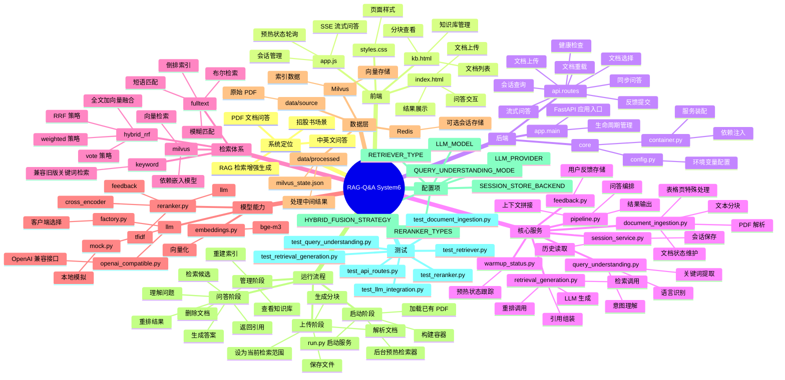

# SYSTEM6 思维导图

> 兼容方式：本文件优先使用 `Typora` 支持的 `Mermaid` 语法展示思维导图；如果当前 `Typora` 版本未正常渲染，可直接查看文末的 Markdown 层级版。

## Mermaid 思维导图

## Markdown 层级版

- RAG-Q&A System6
  - 系统定位
    - PDF 文档问答
    - RAG 检索增强生成
    - 招股书场景
    - 中英文问答
  - 前端
    - `app/static/index.html`：上传、问答、结果展示
    - `app/static/kb.html`：知识库管理
    - `app/static/app.js`：SSE、预热轮询、会话处理
    - `app/static/styles.css`：页面样式
  - 后端
    - `app/main.py`：FastAPI 入口
    - `app/api/routes.py`：API 路由
    - `app/core/config.py`：配置管理
    - `app/core/container.py`：依赖注入
  - 核心服务
    - `document_ingestion.py`：PDF 解析与分块
    - `query_understanding.py`：问题理解
    - `retrieval_generation.py`：检索与生成
    - `pipeline.py`：问答编排
    - `session_service.py`：会话管理
    - `feedback.py`：反馈存储
    - `warmup_status.py`：预热状态
  - 检索体系
    - `keyword`
    - `fulltext`
    - `milvus`
    - `hybrid_rrf`
  - 模型能力
    - Embedding：`bge-m3`
    - Reranker：`cross_encoder / tfidf / feedback / llm`
    - LLM：`openai_compatible / mock`
  - 数据层
    - `data/source/`：原始 PDF
    - `data/processed/`：处理结果
    - `milvus/`：向量库相关资源
    - `Redis`：可选会话存储
  - 运行流程
    - 启动：加载文档并后台预热
    - 上传：保存文件并重建分块
    - 问答：理解问题、检索、重排、生成
    - 管理：查看知识库、删除文档、重建索引
  - 关键配置
    - `LLM_PROVIDER`
    - `LLM_MODEL`
    - `RETRIEVER_TYPE`
    - `HYBRID_FUSION_STRATEGY`
    - `RERANKER_TYPES`
    - `SESSION_STORE_BACKEND`
  - 测试覆盖
    - API
    - 文档解析
    - 问题理解
    - 检索生成
    - 重排
    - LLM 集成
