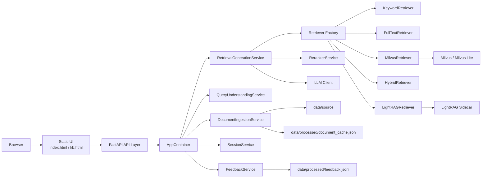
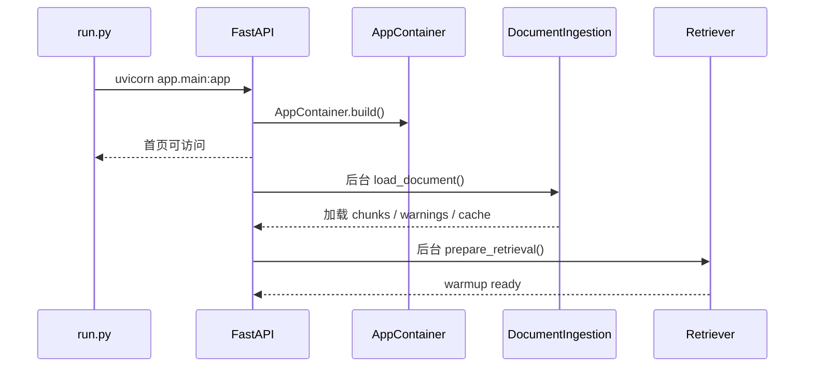
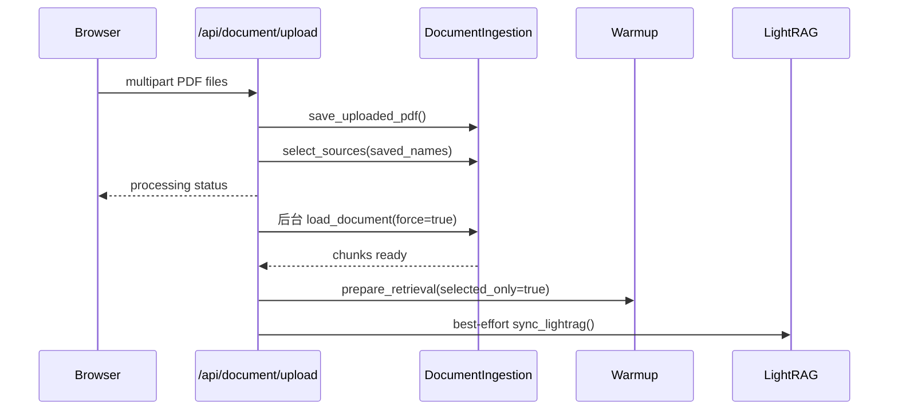
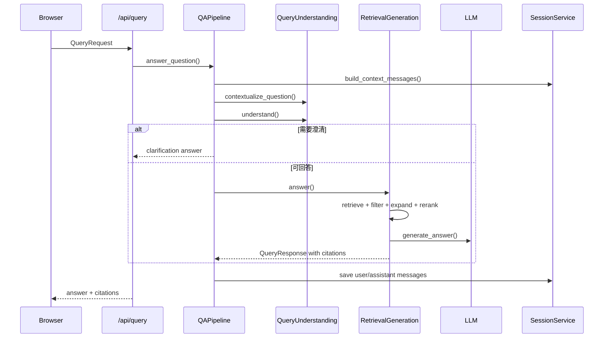

# RAG 问答系统设计文档

## 1. 文档目的

本文档描述当前 RAG-Q&A 系统的设计方案、核心模块、数据流、接口契约、运行配置和扩展边界，用于后续开发、部署、测试和维护。

当前系统是一个面向 PDF 文档的检索增强生成问答应用。用户可上传一个或多个 PDF，系统解析并切分文档内容，构建检索索引，在问答时执行查询理解、检索、重排、生成和引用返回。

## 2. 系统目标

### 2.1 功能目标

- 支持 PDF 上传、解析、缓存和知识库管理。
- 支持中文和英文问题识别，并尽量按输入语言返回答案。
- 支持同步问答和 SSE 流式问答。
- 支持按文档范围限定检索。
- 支持返回引用来源，包括文档名、页码、片段和相关度分数。
- 支持多种检索模式：`keyword`、`fulltext`、`vector`、`hybrid`、`lightrag_*`。
- 支持多种重排策略：`cross_encoder`、`tfidf`、`feedback`、`llm`。
- 支持会话上下文、追问改写和反馈采集。
- 支持 LightRAG sidecar 作为可选知识图谱检索能力。

### 2.2 非功能目标

- 启动阶段不阻塞首页访问，文档加载和检索预热在后台线程执行。
- LightRAG 不可用时不影响主 RAG 流程。
- LLM 远程调用失败时尽量返回基于已检索片段的兜底答案。
- 文档解析结果使用本地缓存，避免重复解析未变化的 PDF。
- 配置通过 `.env` 和环境变量集中管理。

## 3. 总体架构



## 4. 技术栈

| 类别 | 选型 |
| --- | --- |
| Web 框架 | FastAPI |
| ASGI 服务 | Uvicorn |
| 配置管理 | pydantic-settings |
| PDF 文本解析 | pypdf |
| PDF 图像渲染 | pypdfium2 + Pillow |
| 向量模型 | sentence-transformers |
| 向量库 | Milvus / Milvus Lite |
| LLM 接入 | OpenAI-compatible Chat Completions |
| 会话存储 | 内存，Redis 可选 |
| 测试框架 | pytest |

## 5. 目录结构

```text
app/
  main.py                         FastAPI 应用入口
  api/routes.py                   API 路由
  core/config.py                  全局配置
  core/container.py               依赖注入容器
  core/constants.py               检索模式常量
  schemas/query.py                API 请求和响应模型
  services/
    document_ingestion.py         PDF 解析、切分、缓存、知识库管理
    query_understanding.py        查询理解、意图识别、追问改写
    retrieval_generation.py       检索、重排、生成、引用构建
    pipeline.py                   问答编排
    reranker.py                   多策略重排
    embeddings.py                 Embedding 服务
    session_service.py            会话管理
    session_store.py              内存 / Redis 会话存储
    feedback.py                   用户反馈落盘
    retrievers/                   检索器实现
data/
  source/                         上传或预置 PDF
  processed/                      缓存、反馈、Milvus 状态
  lightrag/                       LightRAG 工作目录
docs/                             项目文档
scripts/                          评估和 LightRAG 建图脚本
tests/                            单元和接口测试
run.py                            本地启动入口
```

## 6. 核心模块设计

### 6.1 应用入口

`app/main.py` 负责创建 FastAPI 应用，挂载静态文件，注册 API 路由，并在生命周期启动时构建 `AppContainer`。

启动后系统会开启后台线程：

1. 加载 `data/source/` 下已有 PDF。
2. 解析文档并恢复缓存。
3. 预热默认检索器。
4. 更新 warmup 状态，供前端轮询展示。

`run.py` 默认监听 `127.0.0.1:8000`，如果端口被占用，会在后续端口中寻找可用端口。

### 6.2 依赖容器

`AppContainer` 集中构建并持有所有服务实例：

- `Settings`
- `DocumentIngestionService`
- `QueryUnderstandingService`
- `RetrievalGenerationService`
- `QAPipelineService`
- `SessionService`
- `FeedbackService`
- `IngestionStatusService`
- `WarmupStatusService`
- LightRAG client / indexer，可选

容器负责将配置、检索器、LLM 客户端、重排器和业务服务组装为完整依赖图。

### 6.3 文档解析与知识库

`DocumentIngestionService` 负责 PDF 生命周期：

- 发现 `data/source/` 中的 PDF。
- 保存上传文件。
- 解析 PDF 文本或图像页。
- 按普通文本页和表格页使用不同切分策略。
- 生成 `DocumentChunk`。
- 维护当前选中文档范围。
- 维护文档缓存和知识库列表。

解析模式由 `PDF_PARSER_PROVIDER` 控制：

| 模式 | 行为 |
| --- | --- |
| `pypdf` | 使用 pypdf 提取文本 |
| `doubao` / `doubao_vision` | 将页面渲染成图片并调用多模态模型解析 |
| `auto` | 先用 pypdf，遇到疑似图表页或低文本页再升级到视觉解析 |

缓存文件为 `data/processed/document_cache.json`。缓存签名包含文件名、大小、修改时间、解析器、切分参数、提示词版本和模型名。

### 6.4 查询理解

`QueryUnderstandingService` 支持规则模式和在线 LLM 模式。它输出 `QueryUnderstandingResult`，包括：

- `intent`：问题意图。
- `normalized_question`：归一化问题。
- `detected_language`：语言识别。
- `ambiguous_terms`：歧义项。
- `clarification_needed`：是否需要追问澄清。
- `sub_questions`：子问题拆解。
- `retrieval_hints`：检索提示，如关键词、实体、时间范围和优先章节。

在会话场景中，系统会根据历史消息尝试将追问改写成完整问题。

### 6.5 检索层

检索器由 `app/services/retrievers/factory.py` 按配置或单次请求参数构建。

| 模式 | 实现 | 说明 |
| --- | --- | --- |
| `keyword` | `KeywordRetriever` | 本地关键词匹配 |
| `fulltext` | `FullTextRetriever` | 本地倒排索引检索，支持字段权重和模糊匹配 |
| `vector` / `milvus` | `MilvusRetriever` | Embedding + Milvus 向量检索 |
| `hybrid` | `HybridRetriever` | 全文或关键词检索与向量检索融合 |
| `lightrag_mix` | `LightRAGRetriever` | LightRAG mix 模式 |
| `lightrag_local` | `LightRAGRetriever` | LightRAG local 模式 |
| `lightrag_global` | `LightRAGRetriever` | LightRAG global 模式 |
| `lightrag_hybrid` | `LightRAGRetriever` | LightRAG hybrid 模式 |

Hybrid 检索支持：

- RRF 融合。
- 加权融合。
- 投票融合。

### 6.6 重排层

`RerankerService` 可串联多个重排器：

- `CrossEncoderReranker`：使用本地 cross-encoder 模型打分。
- `TFIDFReranker`：使用 TF-IDF 特征重排。
- `FeedbackAdaptiveReranker`：根据历史正反馈词项调整排序。
- `LLMReranker`：通过 LLM 进行远程相关性排序，失败时启发式兜底。

可通过全局配置启用，也可在单次请求中用 `reranker_enabled` 和 `reranker_types` 覆盖。

### 6.7 生成与引用

`RetrievalGenerationService` 的主流程：

1. 根据请求解析检索模式和 `top_k`。
2. 执行检索。
3. 按 `score_threshold` 过滤低分片段。
4. 结果不足时进行查询扩展重试。
5. 执行重排。
6. 对部分高确定性问题尝试本地精准抽取。
7. 无法本地抽取时调用 LLM 生成答案。
8. LLM 失败时构建抽取式兜底答案。
9. 生成引用列表。
10. 按需返回 debug 信息。

系统对部分招股书类问题实现本地抽取，例如财务指标、获奖工程、技术标准、法定代表人等，以降低模型幻觉风险。

### 6.8 会话与反馈

会话由 `SessionService` 管理，默认使用内存存储，可通过 Redis 配置切换。每次问答会记录用户问题和助手答案，并在后续问题中提供有限历史上下文。

反馈由 `FeedbackService` 写入 JSONL 文件，默认路径为 `data/processed/feedback.jsonl`。反馈数据可被 `FeedbackAdaptiveReranker` 用于排序调整。

### 6.9 LightRAG 集成

LightRAG 以 sidecar 方式接入。主系统默认仍使用 `hybrid` 检索，只有请求显式指定 `lightrag_*` 模式时才调用 LightRAG。

上传或刷新文档后，系统会尝试将文档同步到 LightRAG：

1. 检查 LightRAG client 和 indexer 是否可用。
2. 调用 sidecar 健康检查。
3. 解析本地 PDF 路径。
4. 增量插入 LightRAG。
5. 失败时仅记录状态和日志，不阻断主检索。

## 7. 主要业务流程

### 7.1 启动流程



### 7.2 上传流程



### 7.3 问答流程



## 8. API 设计

### 8.1 健康与状态

| 方法 | 路径 | 说明 |
| --- | --- | --- |
| GET | `/api/health` | 应用健康检查 |
| GET | `/api/document/status` | 文档加载和解析状态 |
| GET | `/api/document/warmup` | 检索器预热状态 |

### 8.2 文档管理

| 方法 | 路径 | 说明 |
| --- | --- | --- |
| POST | `/api/document/upload` | 上传一个或多个 PDF |
| POST | `/api/document/reload` | 重新加载当前文档 |
| POST | `/api/document/select` | 设置后续检索的文档范围 |
| GET | `/api/kb/documents` | 知识库文档列表 |
| GET | `/api/kb/documents/{source_id}/chunks` | 查看指定文档全部 chunk |
| DELETE | `/api/kb/documents/{source_id}` | 删除指定文档 |

### 8.3 问答、会话和反馈

| 方法 | 路径 | 说明 |
| --- | --- | --- |
| POST | `/api/query` | 同步问答 |
| POST | `/api/query/stream` | SSE 流式问答 |
| GET | `/api/session/{session_id}` | 查询会话历史 |
| POST | `/api/feedback` | 提交答案反馈 |

### 8.4 QueryRequest

```json
{
  "question": "公司实际控制人是谁？",
  "session_id": "optional-session-id",
  "top_k": 8,
  "include_debug": true,
  "source_files": ["example.pdf"],
  "retrieval_mode": "hybrid",
  "score_threshold": 0.2,
  "reranker_enabled": true,
  "reranker_types": ["tfidf", "feedback"]
}
```

### 8.5 QueryResponse

```json
{
  "answer_id": "uuid",
  "session_id": "session-id",
  "question": "公司实际控制人是谁？",
  "answer": "根据招股说明书，...",
  "citations": [
    {
      "chunk_id": "example-page-1-chunk-1",
      "source_id": "example.pdf",
      "page_number": 1,
      "score": 0.87,
      "snippet": "引用片段..."
    }
  ],
  "understanding": {
    "intent": "fact_lookup",
    "normalized_question": "公司实际控制人是谁？",
    "detected_language": "zh",
    "strategy": "rules",
    "abstracted_goal": "查询文档事实",
    "retrieval_hints": {}
  },
  "debug": {}
}
```

## 9. 数据设计

### 9.1 DocumentChunk

| 字段 | 类型 | 说明 |
| --- | --- | --- |
| `chunk_id` | string | 片段唯一标识 |
| `source_id` | string | 来源 PDF 文件名 |
| `page_number` | int/null | 页码 |
| `text` | string | 片段文本 |

### 9.2 本地持久化文件

| 路径 | 说明 |
| --- | --- |
| `data/source/` | PDF 源文件目录 |
| `data/processed/document_cache.json` | 文档解析缓存 |
| `data/processed/feedback.jsonl` | 用户反馈 |
| `data/processed/milvus_state.json` | Milvus 索引签名状态 |
| `data/lightrag/` | LightRAG 工作目录 |

## 10. 配置设计

主要配置位于 `app/core/config.py`，通过 `.env` 或环境变量覆盖。

| 配置 | 说明 |
| --- | --- |
| `APP_NAME` / `APP_ENV` | 应用名和环境 |
| `SOURCE_PDF_DIR` | PDF 源文件目录 |
| `DOCUMENT_CACHE_PATH` | 文档缓存路径 |
| `PDF_PARSER_PROVIDER` | PDF 解析模式 |
| `LLM_PROVIDER` | LLM 提供方，默认 `mock` |
| `LLM_API_KEY` / `LLM_BASE_URL` / `LLM_MODEL` | OpenAI-compatible 模型配置 |
| `QUERY_UNDERSTANDING_MODE` | 查询理解模式 |
| `RETRIEVER_TYPE` | 默认检索模式 |
| `HYBRID_FUSION_STRATEGY` | 混合检索融合策略 |
| `RERANKER_ENABLED` / `RERANKER_TYPES` | 重排开关和策略 |
| `EMBEDDING_MODEL_NAME` | Embedding 模型路径 |
| `MILVUS_HOST` / `MILVUS_PORT` | Milvus 地址 |
| `SESSION_STORE_BACKEND` / `REDIS_URL` | 会话存储配置 |
| `LIGHTRAG_BASE_URL` | LightRAG sidecar 地址 |

## 11. 前端设计

当前前端为静态页面：

- `/`：主问答页，支持上传 PDF、查看解析状态、提问和展示答案引用。
- `/kb`：知识库管理页，支持文档列表、chunk 查看和删除。

前端通过 `/api/document/status` 和 `/api/document/warmup` 轮询后端状态，避免用户在后台解析或预热阶段误判系统不可用。

## 12. 异常与降级策略

| 场景 | 策略 |
| --- | --- |
| 启动加载失败 | warmup 状态标记失败，首页仍可访问 |
| PDF 无文本 | 记录 warning；`auto` 模式可尝试视觉解析 |
| Milvus 不可用 | 接口返回可读错误；可切换 `keyword` / `fulltext` |
| LightRAG 不可用 | 主流程不阻断；仅 LightRAG 模式返回 503 或流式错误 |
| 重排器失败 | 记录错误，继续使用未重排结果 |
| LLM 失败 | 返回基于检索片段的抽取式兜底答案 |
| 会话 Redis 不可用 | 回退内存会话存储 |

## 13. 测试设计

测试覆盖重点：

- API 路由和上传状态。
- 文档解析、表格切分、缓存复用和视觉解析升级。
- 查询理解和追问处理。
- 检索生成、引用构建、本地精准抽取。
- 检索模式切换、分数阈值和重排开关。
- 重排器策略和安全加载检查。
- Milvus / retriever 行为。

常用命令：

```bash
pytest
```

或按模块执行：

```bash
pytest tests/test_api_routes.py tests/test_document_ingestion.py tests/test_retrieval_generation.py
```

## 14. 安全与隐私

- 上传文件名使用 `Path(file_name).name` 规避目录穿越。
- API key 通过环境变量或 `.env` 管理，不应提交到版本库。
- 反馈和缓存保存在本地 `data/processed/`，可能包含用户问题和文档片段，生产环境应配置访问控制和备份策略。
- 当前 CORS 允许所有来源，生产环境应收敛到可信域名。
- 当前缺少用户认证和权限隔离，默认适合本地或内网受控场景。

## 15. 当前限制

- 文档解析质量依赖 PDF 类型，扫描件和复杂图表需要视觉模型配置。
- `fulltext` 和部分本地规则对中文招股书语料更友好，英文问题可用但效果可能弱于中文。
- 内存会话在进程重启后丢失；生产环境建议使用 Redis。
- LightRAG 是可选 sidecar，索引同步失败不会自动回滚主知识库。
- 多用户并发上传时，当前选中文档范围是服务级状态，不是用户级隔离。

## 16. 后续演进建议

- 引入用户和知识库租户隔离，将 `selected_sources` 从全局状态迁移到会话或请求级状态。
- 为上传、解析、LightRAG 同步引入任务队列，替代直接后台线程。
- 为 Milvus 和 LightRAG 增加更完整的健康检查和管理页。
- 增加统一日志追踪 ID，串联上传、解析、检索和生成链路。
- 将 CORS、认证、上传大小限制和文件类型校验完善为生产级配置。
- 建立 RAGAS 或固定问题集回归评估，跟踪检索和答案质量变化。
