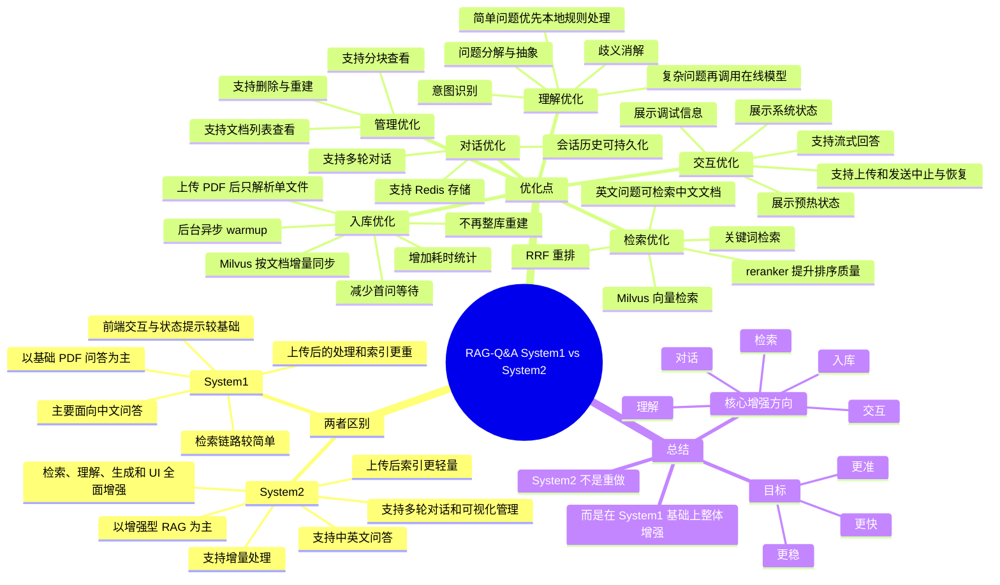

# RAG-Q&A System1 与 System2 升级思维导图

> Typora 需开启 `Preferences -> Markdown -> Diagrams` 才能渲染下方脑图。

```mermaid
mindmap
  root((RAG-Q&A System1 vs System2))
    两者区别
      System1
        以基础 PDF 问答为主
        检索链路较简单
        上传后的处理和索引更重
        主要面向中文问答
        前端交互与状态提示较基础
      System2
        以增强型 RAG 为主
        检索、理解、生成和 UI 全面增强
        上传后索引更轻量
        支持增量处理
        支持中英文问答
        支持多轮对话和可视化管理
    优化点
      检索优化
        关键词检索
        Milvus 向量检索
        RRF 重排
        reranker 提升排序质量
        英文问题可检索中文文档
      理解优化
        意图识别
        歧义消解
        问题分解与抽象
        简单问题优先本地规则处理
        复杂问题再调用在线模型
      入库优化
        上传 PDF 后只解析单文件
        Milvus 按文档增量同步
        不再整库重建
        后台异步 warmup
        减少首问等待
        增加耗时统计
      对话优化
        支持多轮对话
        会话历史可持久化
        支持 Redis 存储
      交互优化
        支持流式回答
        支持上传和发送中止与恢复
        展示系统状态
        展示预热状态
        展示调试信息
      管理优化
        支持文档列表查看
        支持分块查看
        支持删除与重建
    总结
      System2 不是重做
      而是在 System1 基础上整体增强
      核心增强方向
        检索
        理解
        入库
        对话
        交互
      目标
        更准
        更快
        更稳
```
