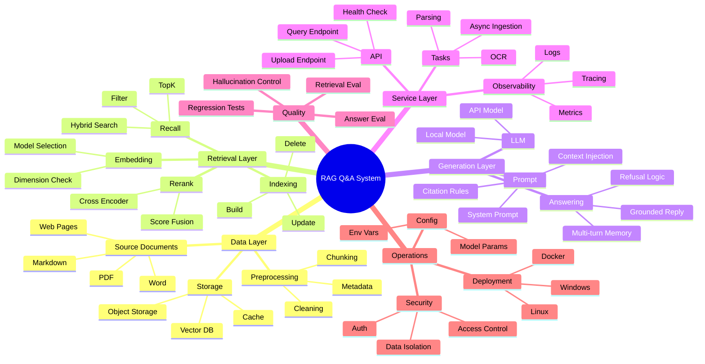
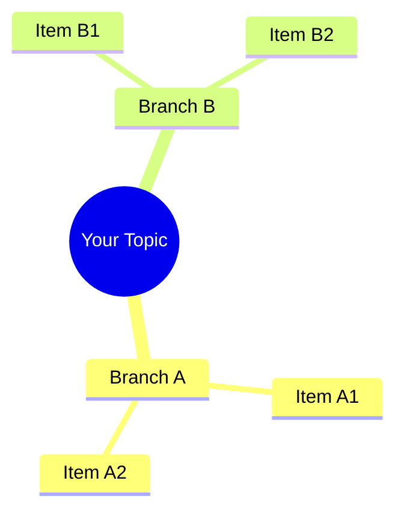

# RAG Q&A System Mind Map

> Open this file in Typora. If Mermaid rendering is enabled, the mind map below can be previewed directly.

## Plain Markdown Outline

- RAG Q&A System
  - Data Layer
    - Source Documents
      - PDF
      - Word
      - Markdown
      - Web Pages
    - Preprocessing
      - Cleaning
      - Chunking
      - Metadata
    - Storage
      - Vector DB
      - Object Storage
      - Cache
  - Retrieval Layer
    - Embedding
      - Model Selection
      - Dimension Check
    - Indexing
      - Build
      - Update
      - Delete
    - Recall
      - TopK
      - Filter
      - Hybrid Search
    - Rerank
      - Cross Encoder
      - Score Fusion
  - Generation Layer
    - Prompt
      - System Prompt
      - Context Injection
      - Citation Rules
    - LLM
      - Local Model
      - API Model
    - Answering
      - Grounded Reply
      - Refusal Logic
      - Multi-turn Memory
  - Service Layer
    - API
      - Query Endpoint
      - Upload Endpoint
      - Health Check
    - Tasks
      - OCR
      - Parsing
      - Async Ingestion
    - Observability
      - Logs
      - Metrics
      - Tracing
  - Quality
    - Retrieval Eval
    - Answer Eval
    - Hallucination Control
    - Regression Tests
  - Operations
    - Config
      - Env Vars
      - Model Params
    - Deployment
      - Docker
      - Windows
      - Linux
    - Security
      - Auth
      - Access Control
      - Data Isolation

## Minimal Template

Replace the text below with your own topic and branches:

