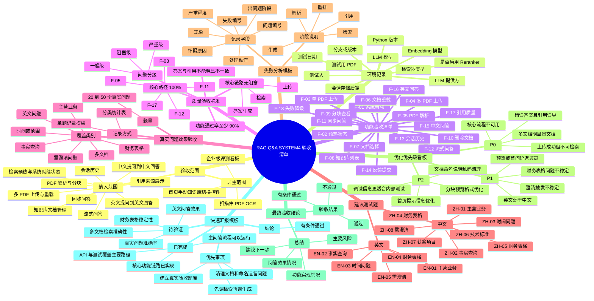

# RAG Q&A SYSTEM4 验收清单思维导图

> 推荐在 Typora 中开启 Mermaid 渲染后查看。
> 如果当前 Typora 版本不支持 `mindmap`，可直接使用文末的 Markdown 大纲。

## Markdown 大纲兜底版

- RAG Q&A SYSTEM4 验收清单
  - 验收范围
    - 纳入范围
      - 多 PDF 上传与重载
      - PDF 解析与分块
      - 知识库文档管理
      - 同步问答
      - 流式问答
      - 会话历史
      - 引用来源展示
      - 中文提问到中文回答
      - 英文提问到英文回答
      - 检索预热与系统就绪状态
    - 非主范围
      - 首页手动知识库切换控件
      - 扫描件 PDF OCR
      - 企业级评测看板
  - 环境记录
    - 测试日期
    - 测试人
    - 分支或版本
    - Python 版本
    - LLM 提供方
    - LLM 模型
    - 检索器类型
    - 是否启用 Reranker
    - Embedding 模型
    - 会话存储后端
    - 测试用 PDF
  - 功能验收清单
    - F-01 到 F-18
  - 质量验收标准
    - 功能通过率至少 90%
    - 核心路径 F-03 F-05 F-11 F-12 F-17 达到 100%
    - 上传 检索 答案生成三条链路无阻塞
    - 答案与引用不能明显不一致
    - 问题分级
      - 阻塞级
      - 严重级
      - 一般级
  - 真实问题效果验收
    - 20 到 50 个真实问题
    - 覆盖事实查询 主营业务 财务表格 时间或范围 多文档 英文 需澄清
    - 记录方式
      - 分类统计表
      - 单题记录模板
  - 建议测试题
    - 中文
      - ZH-01 到 ZH-08
    - 英文
      - EN-01 到 EN-05
  - 失败分析模板
    - 阶段
      - 解析
      - 检索
      - 重排
      - 生成
      - 引用
  - 优化优先级看板
    - P0
    - P1
    - P2
  - 最终验收结论
    - 验收结果
    - 总结
  - 快速汇报模板
    - 已完成
    - 待验证
    - 优先事项
