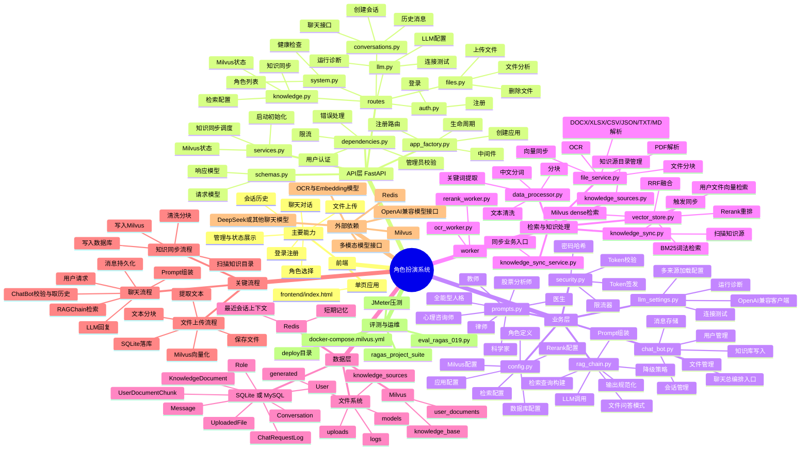

# 项目架构思维导图

下面这份脑图基于 [CODE_ANNOTATION_AND_ARCHITECTURE.md](./CODE_ANNOTATION_AND_ARCHITECTURE.md) 和 [technical_overview.md](./technical_overview.md) 整理，适合快速理解项目整体结构。

## 快速阅读顺序

1. 先看 `前端 → API层 → 业务层`，理解请求是怎么进来的。
2. 再看 `检索与知识处理`，理解 RAG 为什么会慢、为什么会命中知识库。
3. 最后看 `数据层` 和 `关键流程`，理解数据落在哪里、链路怎么走。

## 你现在最常关心的部分

- 聊天入口：`conversations.py -> chat_bot.py -> rag_chain.py`
- 检索核心：`vector_store.py`
- 文件问答：`files.py -> file_service.py -> vector_store.py`
- 模型配置：`.env + llm_settings.py + config.py`
- 知识库同步：`knowledge_sync.py + knowledge_sync_service.py`
